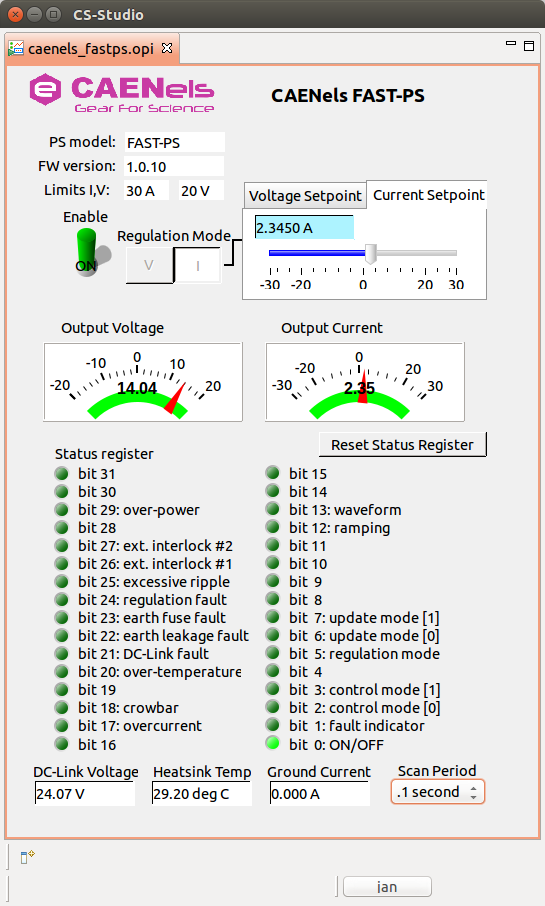

EPICS IOC for CAENels FAST-PS
=============================

This is an EPICS IOC for CAENels power supplies:

  * [FAST-PS](http://www.caenels.com/products/fast-ps/),
  * [FAST-PS-M](http://www.caenels.com/products/fast-ps-m/),
  * [FAST-PS1K5](http://www.caenels.com/products/fast-ps-1k5/),
  * [NGPS](http://www.caenels.com/products/ngps/)

Some parts of this IOC are inspired by **Caen A36xx EPICS Device Support** by
Lawrence Berkeley National Laboratory, Accelerator Technology Group,
Engineering Division.

Required modules
================

| Module | Link |
| --- | --- |
| asyn | https://github.com/epics-modules/asyn |
| EPICS 3.14.12.5 | https://launchpad.net/epics-base/3.14/3.14.12.5 |
| stream | https://github.com/epics-modules/stream |
| calc | https://github.com/epics-modules/calc |
| seq | http://www-csr.bessy.de/control/SoftDist/sequencer/Installation.html |
| sscan | https://github.com/epics-modules/sscan |
| stream | https://github.com/epics-modules/stream |

Required firmware
================
Release 1.3.x.

Screen for Control System Studio
================================

